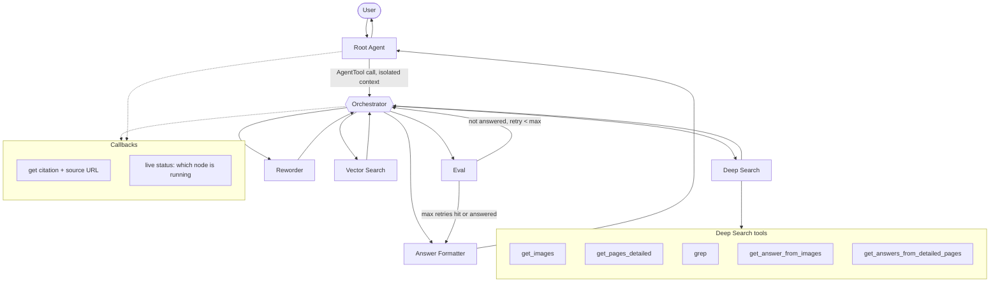

# Edenview — Agentic RAG Architecture Spec

## Overview

A single Orchestrator loop handles the entire retrieval-and-answer cycle for one query,
isolated in its own context from the Root Agent (which only holds the user-facing
conversation). The Orchestrator retries internally, capped at a max iteration count,
and always returns a final answer to Root — never escalates back up mid-flight.

## Diagram

## Node summaries

| Node | Role | Model | Notes |
|---|---|---|---|
| **Root Agent** | Holds the persistent, user-facing conversation. Calls Orchestrator as an `AgentTool`. Never sees retrieval internals. | none (plain routing) or qwen3.5:2b | Stays clean across a multi-turn session — no retrieved chunks in its history. |
| **Orchestrator** | Runs one query end-to-end: decides which of Reworder / Vector Search / Eval / Deep Search to call, and in what order. Loops internally until Eval says "answered" or max retries is hit. | qwen3.5:2b | Implement as `LoopAgent` with `max_iterations` set; Eval sets `escalate=True` to exit early. |
| **Reworder** | Rewrites/rephrases the query (or a sub-question) to better match corpus phrasing before retrieval. | qwen3.5:2b | Cheap, structured task — no need for the primary model. |
| **Vector Search** | Runs the deterministic retrieval pipeline: dense (Qdrant) + BM25 + RRF fusion + cross-encoder rerank. Always executes the full pipeline — never partial. Returns chunks *with metadata* (parent page ID, page number, any image refs on that page). | none (non-LLM, cross-encoder is a small dedicated model) | This is your highest-value quality lever — keep it a fixed, always-on step, not agent-gated. Metadata returned here is what Deep Search reads from. |
| **Eval** | Grades whether the retrieved/reformulated context is sufficient to answer. CRAG-style lightweight grader, structured output only (e.g. `{"sufficient": bool, "reason": str}`). | qwen3.5:2b | This is the only node allowed to trigger a retry or an exit from the loop. |
| **Deep Search** | Fallback for when Vector Search's chunks aren't enough on their own. Uses the chunk *metadata* Vector Search already returned (which page a chunk came from, whether that page has images) to go pull the fuller page content and images those chunks pointed to — it doesn't re-search the corpus, it reads deeper around what was already found. | qwen3.5:2b, orchestrates tool calls | See tool list below. |
| **Answer Formatter** | Produces the final, user-facing answer with citations. | primary (qwen3:14b or 30b-a3b) | The one node where output quality matters most — don't economize here. |

## Deep Search tools

These all key off the **chunk metadata Vector Search already returned** (parent page ID/number, image refs on that page) — Deep Search is reading deeper around chunks already retrieved, not re-searching the corpus from scratch.

- `get_images` — given a chunk's page metadata, retrieve any images present on that page (as flagged during ingestion).
- `get_pages_detailed` — given a chunk's parent page ID, pull the full page content (beyond the chunk's own boundaries), so surrounding context that didn't make it into the chunk is available.
- `grep` — exact/lexical search across the raw corpus text, for when semantic retrieval missed an exact term/clause match (useful for contract language, case citations, defined terms).
- `get_answer_from_images` — run a targeted query against the images pulled by `get_images` (e.g. reading a table, chart, or scanned page an OCR-only chunk missed).
- `get_answers_from_detailed_pages` — run a targeted query against the full page content pulled by `get_pages_detailed`.

## Callbacks

- **Citation callback** — attaches full provenance to every answer, not just a document name: source document, page/section number, chunk ID, any image reference used (if Deep Search pulled one in), and a viewable URL/path the user can click to open the original page. This is what lets a lawyer or clinician actually verify a claim against the source document, which is the whole point of on-prem RAG for a compliance-sensitive buyer.

- **Live status callback** — the mechanism behind the UI's real-time "what's happening right now" view. Every node (Reworder, Vector Search, Eval, Deep Search, Answer Formatter) fires `before_tool_callback`/`before_agent_callback` when it starts and `after_tool_callback`/`after_agent_callback` when it finishes. Each fire publishes a small message — `{"node": "vector_search", "status": "running"}` — to a Redis pub/sub channel keyed by session ID. A FastAPI SSE endpoint subscribes to that channel and streams the messages to the Next.js frontend as they arrive. The UI then lights up the corresponding box in the pipeline diagram (e.g. "Vector Search — running" → "Vector Search — done" → "Eval — running") so the user watching the query/chat view sees the actual query traveling through the pipeline live, not just a generic spinner. This uses callbacks rather than ADK's built-in `/run_sse` stream specifically because callbacks still fire correctly inside the Orchestrator's isolated `AgentTool` context, whereas the outer event stream doesn't reliably surface what's happening inside an `AgentTool`.

## Build notes for implementation

1. **Root → Orchestrator must be an `AgentTool`, not `sub_agents`/`transfer_to_agent`.** The latter hands off the full conversation and shares session state; only `AgentTool` isolates the Orchestrator's retrieval mess from Root's context.
2. **Orchestrator = `LoopAgent`** wrapping Reworder / Vector Search / Eval / Deep Search as sub_agents, with a hard `max_iterations` cap (start at 3, matching published agentic-RAG evaluations). Eval sets `tool_context.actions.escalate = True` to exit early once satisfied.
3. **Vector Search's rerank step is not optional** — bake the cross-encoder rerank into the Vector Search node itself so it always runs, rather than something the Orchestrator has to remember to invoke.
4. **Callbacks fire regardless of AgentTool isolation** — use them (not the outer SSE event stream) for live status, since `AgentTool` internals don't reliably surface through ADK's built-in `/run_sse`.
